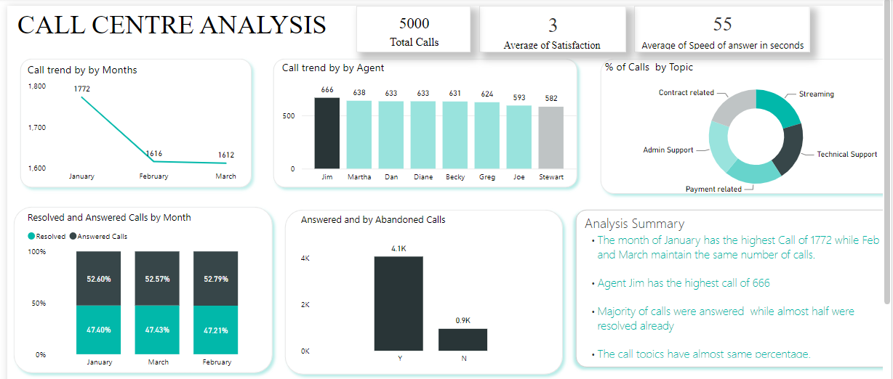

# Call_center1

## Dataset Overview
 The dataset consist of calls recorded by a call center company for the month of Jannuary to march in the year 2021. The dataset was provided by quantum analytics NG. It contains 16 columns and 5000 rows. It is majorly about the performance of  call agents, the number of call answered, abandoned and resolved
 - Agents; Names of call agents in the company
 - Answered; Calls that were being picked up 
 - Resolved; Calls that picked, and solutions was provided to the customer complaint
 - Abandoned; Calls that werent picked 
 ## To gather insights on how the company is performing, I was directed to provide insight on the following question
 - Trends of call from January to March
 - Call trends by agent
 - % of calls by topic
 - Resolved and answered calls by month
 - Answered and abandoned calls.
 ## The process i took to provide answers to the question above 
 - Cleaan the data, replace null with 0
 - Wrote Dax formular to calculate the abandoned and answered calls
 - Created repoert and visualized with charts
 - Designed my dashboard with the report
 ## Summary
 - There's a decrease in calls from january to febuary and constant call trend frrom febuary to march.
 -Agent Jim has the highest number of calls while agent stawart has the least.
 - Not all calls answered were being resolved and not all calls were answered
 
 
